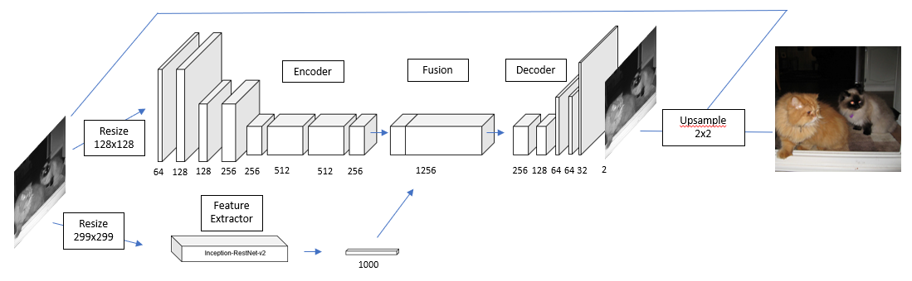
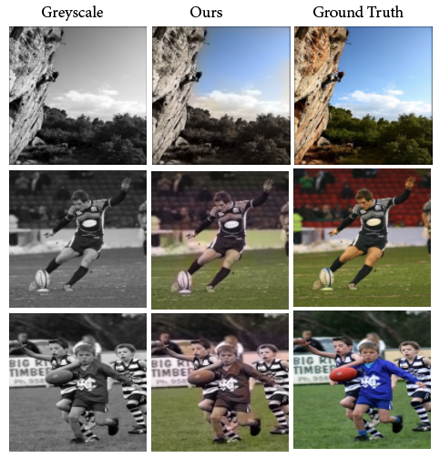

# Deep Image Colorization

Implementation of deep image colorization model using CNN and pre-trained Inception-ResNet-v2. This is a project as a part of **DD2424-Deep Learning in Data Science** course at **KTH Royal Institute of Technology** Stockholm. 

### Authors
[Muhammad Irfan Handarbeni], [Fadhil Mochammad], [Sri Datta Budaraju]

The implementions are in Python using TensorFlow and Keras framework.

### Abstract
With the motivation is explore applications of Deep Learning in Computer Vision, we have taken up the task of image colorization. In this project we try to build a Deep Neural Net to colorize the pixels in a gray-scale image. We came up with an approach that explores various concepts such as Convolutional Neural Networks, Autoencoders, and Pre-trained Networks. Our approach is the combination of the ideas from the papers by [Iizuka and Simo-Serra *et al*. (2016)] and  [Baldassarre, Gonzales-Moren and Rodes-Guirao (2017)] which focus on Image Colorization using an Autoencoder architecture with the assistance of a classification network.

### Overview
Based on the research by [Iizuka and Simo-Serra *et al*. (2016)] and  [Baldassarre, Gonzales-Moren and Rodes-Guirao (2017)], we decided to reimplement their proposed approach with some minor modification. The architecture uses Convolutional Neural Networks with Autoencoders concept and combined it with a pre-trained network (Inception-ResNet-v2) which provide high-level features to assist the colorization process.

The network has four main components, which are encoder, decoder, feature extractor and fusion. Encoder component extracts the mid-level features of the images where the feature extractor component using Inception-RestNet-v2 extracts the high-level features. These features are merged in the fusion component. The decoder consumes these embedded features to predict the a* and b* components and produce the colorized images.

### Experiments and Result

In our experiments, we wanted to make sure that the network is correctly built. Thus, we tried to run two short experiments. First, we overfitted the network into one image to see if the network can recover the actual colored image. Then, we trained the network on a small amount of Tiny ImageNet data to see its performance. Finally, we trained the network on the ImageNet dataset. However, due to limited time for this project, we only used a relatively small amount of data which is 2000 images from the ImageNet dataset.

[//]: # 

   [Muhammad Irfan Handarbeni]: <https://github.com/handarbeni>
   [Fadhil Mochammad]: <https://github.com/fadhilmch>
   [Sri Datta Budaraju]: <https://github.com/bsridatta>
   [Iizuka and Simo-Serra *et al*. (2016)]: <http://iizuka.cs.tsukuba.ac.jp/projects/colorization/en/>
   [Baldassarre, Gonzales-Moren and Rodes-Guirao (2017)]: <https://arxiv.org/abs/1712.03400>